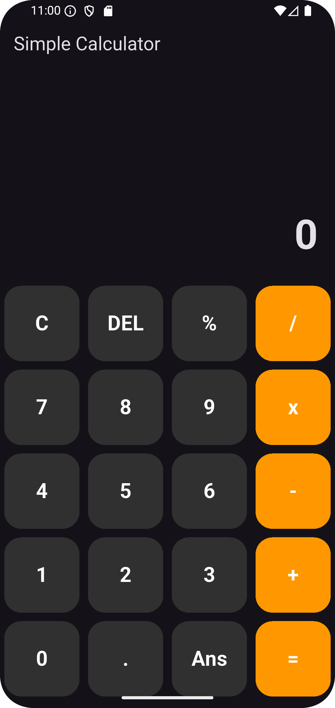
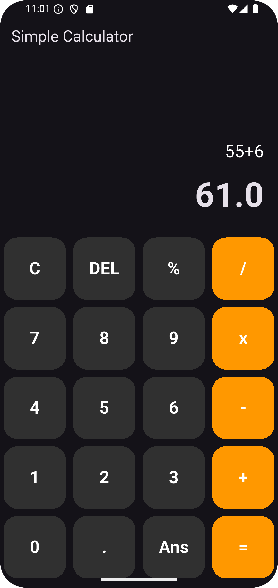

# Simple Calculator 🧮

A clean, responsive calculator app built with Flutter. This project focuses on logic implementation and UI grid layouts.

## ✨ Features
- Basic arithmetic operations (Addition, Subtraction, Multiplication, Division).
- Real-time expression parsing.
- Responsive design for different screen sizes.
- "Delete" and "Clear All" functionality.

## 🛠 Tech Stack
- **Framework:** Flutter
- **Language:** Dart
- **Packages:** `math_expressions` (for parsing string logic).

## 🧠 What I Learned
- How to manage complex string-based logic in Dart.
- Implementing a dynamic `GridView` for UI elements.
- Handling state updates within a `StatefulWidget`.
## 📸 Screenshots
| Home Screen | Calculation |
| --- | --- |
|  |  |

---
Developed as part of my Flutter Portfolio.
